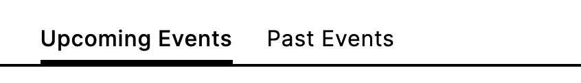

# Technical Documentation

## **Work Breakdown**

We developed the project by defining common guidelines for development. Each member of the group was able to touch on all aspects relating to the development. In particular:

| Member          | Main focus                                            |
| --------------- | ----------------------------------------------------- |
| Luca Leoni      | Focus on pages implementation and chatbot integration |
| Luca Minotti    | Focus on component development and CSS styling        |
| Francesco Ratti | Focus on pages implementation and database            |

 

---

## **Technologies and Motivations**

- For the _server side_ development we have used **NodeJS with Express**.
- For the _hosting_ our application we have used **Heroku**. The website is accessible at [plug-it.herokuapp.com](https://plug-it.herokuapp.com/).
- Since the website is data-base driven, for the _database implementation_ we have used **PostgreeSQL**.
- Since visibility for a company's website is critical, we decided to use the **Server-Side-Rendering (SSR)** option to render pages on the server side. This choice allows web crawlers to better index the website, resulting in better ranking in search results.

 

---

## **Best Practices Compliance**

During the development of the system, all principles of good practice were followed. In particular:

- Every relevant aspect of the code has been **highly commented** (html structure, components, server, database structure) in order to facilitate reading.
- All the principles of **accessibility** have been scrupulously followed. In particular, the W3C-WAI standards were followed. Some of the measures adopted:
  - [x] Brief descriptions of non-text content (such as images) are provided
  - [x] Labels for form controls, input, and other user interface components are provided
  - [x] Headings, lists, input fields, and content structures are marked-up properly
  - [x] Sequences of information or instructions are independent of any presentation
  - [x] Default foreground and background color combinations provide sufficient contrast
  - [x] Text reflows in small viewports and when users make the text larger
  - [x] Images of text are avoided
  - [x] All functionality that is available by mouse is also available by keyboard
  - [x] Pages have clear titles and are organized using descriptive section headings
  - [x] There is more than one way to find relevant pages within a set of web pages
  - [x] Users are informed about their current location within a set of related pages
  - [x] The keyboard focus is visible, and the focus order follows a meaningful sequence
  - [x] The purpose of a link is evident
  - [x] Buttons, links, and other active components are large enough to make them easier to activate by touch
- The website has been developed with attention to **SEO ranking**. In addition to what is listed above, all pages have been provided with appropriate meta tags.
- Reusable and modular Nuxt components

> All the pages of the website have been analyzed with the following tools:
>
> - **WAVE**: no errors, warning or contrast error have been detected
> - **Google Lighthouse**: all Performance, Best Practices and Accessibility tests have been successfully passed with an average score of 100-95.

> **NOTICE: The performance score on some pages is negatively affected by the loading of the _external map_ provided by Google. This component sometimes prints informational messages to the console which also negatively affect the Best Practice score. However, the impact is minimal : the score is still largerly above 90 on these pages (events and contact pages)**.

 

---

## **Responsiveness**

The entire website was developed with responsiveness in mind. Each component is therefore able to adapt and change its appearance. For example, in small devices such as smartphones or tablets, the complete navigation bar is hidden and replaced by a burger menu. Furthermore, the grids and paragraphs are readjusted to show only one element per line if the viewport size is not sufficient. The chatbot window is also designed to always be displayed correctly regardless of the screen size.

 

---

## **Plugins**

- **[mmcc-vue](https://gitlab.com/i3lab/mmcc/frontend/mmcc-vue/-/tree/master/):**  
  This plugin is used for the implementation of the _Multi Modal Chatbot_. The chatbot performs the following operations:

  

- **[redirect-ssl](https://www.npmjs.com/package/redirect-ssl):**  
  This plugin is used to force the use of _HTTPS_. Thanks to its adoption, every request made via HTTP is translated into an equivalent HTTPS request.
  This allows to avoid mixed content errors, which occurs when some resources are loaded over a secure HTTPS connection and some others are loaded over an insecure HTTP connection.

 

---

## **Components**

We have developed the components of the website trying to maximize their _reusability_ on the various pages. This, in addition to allowing _modularity_, also has benefits on the _usability_ of the system. In fact, the user views familiar components while browsing the website. On the other hand, we have also taken into account that an excessive degree of customization could have made it difficult to use them effectively.

- ## **_Card_**

  A card with an image and a structured description placed alongside. This component can be used inside a Grid component but also standalone. It recives all the information needed as props.  
   **Actual usage on the website:** to show information in grids listing employees, events, areas and services. |

  | Prop              | Type     | Default | Note                                                                                                                                                                          |
  | ----------------- | -------- | ------- | ----------------------------------------------------------------------------------------------------------------------------------------------------------------------------- |
  | `image`           | `String` | `""`    | (Required) The path of the image to be shown inside the card component. Displayed size: 100px x 100px.                                                                        |
  | `heading`         | `String` | `""`    | (Required) The main heading of the card element.                                                                                                                              |
  | `destinationLink` | `String` | `""`    | (Required) The destination link for the card element. It is used to redirect the user when clicking on the main heading and the image of the card.                            |
  | `preLabel`        | `String` | `""`    | An optional additional field which preceeds the label of the card (optional)                                                                                                  |
  | `label`           | `String` | `""`    | An optional additional label to be shown below the heading.                                                                                                                   |
  | `labelIcon`       | `String` | `""`    | An optional icon to be shown alongside the label. The props specify the name of the CSS class of the icon. [Material Design Icons](https://materialdesignicons.com) are used. |
  | `subheading`      | `String` | `""`    | An optional subheading for the card to be shown below the label.                                                                                                              |
  | `subheadingLink`  | `String` | `""`    | A link for the subheading of the card. It is used to redirect the user when clicking on the subheading of the card.                                                           |
  | `summary`         | `String` | `""`    | A brief summary paragraph for the card component.                                                                                                                             |

     

  #### Example

    

  ***

   

- ## **_Grid_**

  A responsive grid of made up of Card elements. It shows up to two card elements per row and, optionally, one featured element in the first row. It recives as prop an array containing all the information required by the Card components.  
   **Actual usage on the website:** to list employees, events, areas and services.

  | Prop              | Type     | Default | Note                                                                                                                                                              |
  | ----------------- | -------- | ------- | ----------------------------------------------------------------------------------------------------------------------------------------------------------------- |
  | `featuredElement` | `Object` | `null`  | Featured card element to be shown in the first row of the grid. It consists of an object containing all the props required by the card component.                 |
  | `elements`        | `Array`  | `[]`    | (Required) List of card elements to be shown in the body of the grid. It consists of an array of objects containing all the props required by the card component. |

     

  #### Example

  

  ***

   

- ## **_BaseButton_**

  A general purpose button with an optional icon. On mouse hover the icon is substituted with the outlined version (if not disabled via props)
  **Actual usage on the website:** as button for links or to send forms

  | Prop        | Type      | Default    | Note                                                                                                                                                                          |
  | ----------- | --------- | ---------- | ----------------------------------------------------------------------------------------------------------------------------------------------------------------------------- |
  | `label`     | `String`  | `""`       | (Required) The label for the button                                                                                                                                           |
  | `type`      | `String`  | `"button"` | The HTML type of the button (button or submit).                                                                                                                               |
  | `icon`      | `String`  | `""`       | An optional icon to be shown alongside the label. The props specify the name of the CSS class of the icon. [Material Design Icons](https://materialdesignicons.com) are used. |
  | `hoverFlag` | `Boolean` | `true`     | If true, it substitutes the icon with the outline version on mouse hover.                                                                                                     |

     

  #### Example

    

  ***

   

- ## **_IconButton_**

  A button which contains only a mandatory icon and without any label. On mouse hover the icon is substituted with the outlined version (if not disabled via props)
  **Actual usage on the website:** as button to send messages in the chatbot

  | Prop         | Type      | Default    | Note                                                                                                                                                                  |
  | ------------ | --------- | ---------- | --------------------------------------------------------------------------------------------------------------------------------------------------------------------- |
  | `aria-label` | `String`  | `""`       | description of the action that the button performs, for accessibility purposes                                                                                        |
  | `type`       | `String`  | `"button"` | The HTML type of the button (button or submit).                                                                                                                       |
  | `icon`       | `String`  | `""`       | The icon to be shown alongside the label. The props specify the name of the CSS class of the icon. [Material Design Icons](https://materialdesignicons.com) are used. |
  | `hoverFlag`  | `Boolean` | `true`     | If true, it substitutes the icon with the outline version on mouse hover.                                                                                             |

     

  #### Example

    

  ***

     

- ## **_Breadcrumb_**

  A dynamic breadcrumb. The route to be shown is defined by the query-parameter 'route' in the URL. Specifically:

  - if 'route' is not specified (or is equal to -1) the defaultRoute is displayed;
  - otherwise (route>=0) its value represent the index of the element of the 'altRoutes' array to be displayed.
    A single route (made up of the traversed pages) is specified as an array of objects (specifying path and title of the traversed pages).

  **Actual usage on the website:** as a two level static or dynamic breadcrumb.

  | Prop           | Type     | Default | Note                                                                                                                                                                                                        |
  | -------------- | -------- | ------- | ----------------------------------------------------------------------------------------------------------------------------------------------------------------------------------------------------------- |
  | `defaultRoute` | `Array`  | `[]`    | (Required) The default breadcrumb defined as an array of pairs (path,title). It's the route shown when no other alternative route is activated. E.g., `[{ title: 'Areas', path: '/areas' }]`                |
  | `altRoutes`    | `Array`  | `[]`    | Array of alternative breadcrumbs . The alternative to be shown is at position 'route'. Each route is specified as an array of pairs (path, title). E.g., `[[{ title: 'Our Services', path: '/services' }]]` |
  | `currentPage`  | `String` | `""`    | Name of the current page. E.g., `Service XYZ`                                                                                                                                                               |

     

  #### Example

  

  ***

   

- ## **_Chat_**

  A chat to interact with the multi modal chatbot of the website. It consists of a button fixed at bottom-right of the page that allow one to open the chatbot popup.  
  **Actual usage on the website:** as chatbot component

  | Prop       | Type    | Default | Note                                                                |
  | ---------- | ------- | ------- | ------------------------------------------------------------------- |
  | `chatList` | `Array` | `[]`    | (Required) The list of all the messages exchanged with the chatbot. |

     

  #### Example

  

  ***

   

- ## **ContactForm**

  A contact form to contact the company. It internally manages the sending of the message to the server. Fields are validated through HTML.
  It is composed of four different views: form fields, sending interface, success interface, error interface.  
  **Actual usage on the website:** as a contact form for the Contacts, Service and Event page.

  | Prop       | Type    | Default | Note                                                                                                                                   |
  | ---------- | ------- | ------- | -------------------------------------------------------------------------------------------------------------------------------------- |
  | `heading`  | `Array` | `[]`    | (Required) The heading of the form displayd before the fields`                                                                         |
  | `pageName` | `Array` | `[]`    | (Required) The identifier of the page. This value is needed to automatically link the message to the page from which it has been sent. |

     

  #### Example

  

  ***

   

- ## **_MapView_**

  A Google map view with a description positioned alongside. Based on the Google My Maps iframe. It requires the identifier of the map and offers a slot to be shown as description.  
   **Actual usage on the website:** as a map view for Contacts page and to show the location of an event.

  | Prop    | Type     | Default                             | Note                                                                  |
  | ------- | -------- | ----------------------------------- | --------------------------------------------------------------------- |
  | `mapId` | `String` | `1xRytj_13i84wCH0axdS4uMCM_YuJKiJ4` | The Google My Map identifier. By default is set to the Plug-IT HQ map |

  | Slot          | Note                                 |
  | ------------- | ------------------------------------ |
  | `defaultSlot` | What to display next to the map view |

     

  #### Example

  

  ***

   

- ## **_Paragraph_**

  A general purpose paragraph with an (optional) image. The content of the paragraph is specified as a slot (enabling the use of html tags). If an image is specified, it is also possible to specify its position (either left or right).  
  **Actual usage on the website:** as a text paragraph in almost all the pages

  | Prop       | Type     | Default   | Note                                                    |
  | ---------- | -------- | --------- | ------------------------------------------------------- |
  | `image`    | `String` | `""`      | The path of the optional image to be shown alongside.   |
  | `imageCap` | `String` | `""`      | The alt attribute for the image for accessibility.      |
  | `position` | `String` | `"Right"` | position of the paragraph's slot. Either left or right. |

  | Slot          | Note                                      |
  | ------------- | ----------------------------------------- |
  | `defaultSlot` | The paragraph's content (e.g., some text) |

     

  #### Example

  

  ***

   

- ## **_SelectFilter_**

  A select filter for the areas that emits 'filter-change' events on selection.  
  **Actual usage on the website:** in Events page and Our Service page to filter the results by area of belonging.

  | Emitted event   | Condition                      | Value emitted      |
  | --------------- | ------------------------------ | ------------------ |
  | `filter-change` | When the selected area changes | Selected area name |

     

  #### Example

  

  ***

   

- ## **_TabView_**

  TabView for switching between tabs. On tab switch emit a 'tab-change' event.  
  **Actual usage on the website:** in Events page to filter the results by upcoming/past.

  | Prop   | Type    | Default | Note                                                                  |
  | ------ | ------- | ------- | --------------------------------------------------------------------- |
  | `tabs` | `Array` | `[]`    | (Required) Array of tab names. Element tab[0] is selected by default. |

  | Emitted event | Condition                     | Value emitted      |
  | ------------- | ----------------------------- | ------------------ |
  | `tab-change`  | When the selected tab changes | Selected tab index |

     

  #### Example

  

  ***

   

- ## **_Slideshow_**

  Slideshow of images with a Paragraph component inside. The slider can be controlled both through arrows and dot icons that have been appropriately labelled as buttons for accessibility.  
  **Actual usage on the website:** in the homepage to show popular/new services

  | Prop           | Type     | Default | Note                                                                                                                                                                                                                                                                                                                         |
  | -------------- | -------- | ------- | ---------------------------------------------------------------------------------------------------------------------------------------------------------------------------------------------------------------------------------------------------------------------------------------------------------------------------- |
  | `slides`       | `Array`  | `[]`    | (Required) The slides to be shown. It consists of an array of objects, each containing image, alt, title, description, labelType (optional, either 'popular' or 'new') and link. E.g., `[{ image: '/1.png', alt: 'Some text', title: 'Slide title', description:'Slide body', labelType: 'new', link: '/services/25'}, ...]` |
  | `timePerSlide` | `Number` | `10000` | Time in milliseconds for each slide. Default value: 10sec.                                                                                                                                                                                                                                                                   |

     

  #### Example

  

  ***

   

- ## **_TheFooter_**

  Footer of the website with company icon and social icons (appropriately labelled for accessibility).  
  **Actual usage on the website:** as footer

     

  #### Example

  

  ***

   

- ## **_TheHeader_**

  Responsive header with company logo and navigation links.  
  **Actual usage on the website:** as header

     

  #### Examples

   
  
